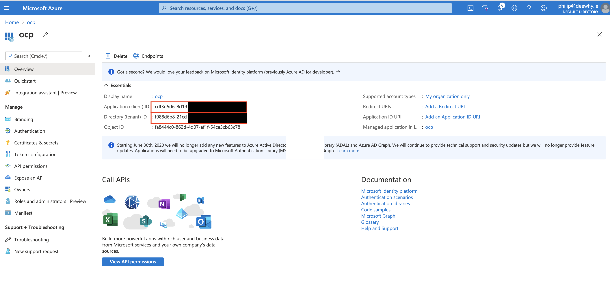

## Configuring Azure active directory for api access.

From the Default directory, click on "App registrations"

Click on "New registration", and fill in the details as follows. 

From the app page, take note of the tenant id and client id

Click on "Api Permissions", then click on "Add a permission". From the panel on the right, select "Azure active directory graph". 

From the list of available permissions, select "Directory Read.All"

From the app page, click on "Certificates and secrets"

From this page, create a new client secret and take note of the secret.

Finally, navigate to the subscriptions page and take note of the subscription id.

Use the secret, subscription id, tenant id and client id to generate a secret:

`oc create secret generic azure-group-sync --from-literal=AZURE_SUBSCRIPTION_ID=xxxx --from-literal=AZURE_TENANT_ID=xxxx --from-literal=AZURE_CLIENT_ID=xxxx --from-literal=AZURE_CLIENT_SECRET=xxxx`

